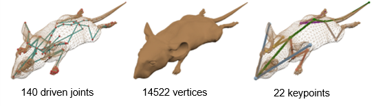
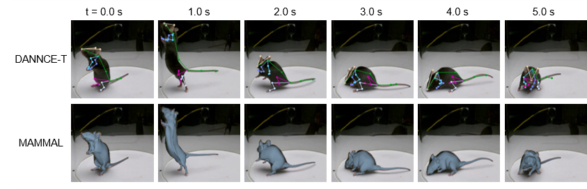

# MAMMAL_mouse
This is the sub project of the manuscript _Three-dimensional surface motion capture of multiple freely moving pigs using MAMMAL_ (unpublished). By running `run.sh`, we fit the an articulated mouse model to the `markerless_mouse_1` sequence proposed by [DANNCE](https://github.com/tqxli/dannce-pytorch) paper. 

Here is the model we used. The model was extracted from the blender file `C57BL6_Female_V1.2_opensource-file.blend` proposed by _A three-dimensional virtual mouse generates synthetic training data for behavioral analysis_. 



Here is a comparison between DANNCE and MAMMAL_mouse. The DANNCE-T model was the temporal version of DANNCE (https://github.com/tqxli/dannce-pytorch). The results were generated from the pretrained model provided by the original project. 



## Environment
We recommend to use Anaconda to configure the environment. 

1. We assume that you have installed anaconda. Create a virtual environment as 
```
conda create -n mouse python=3.9
conda activate mouse
```
2. Install pytorch as 
```
conda install pytorch torchvision torchaudio cudatoolkit=11.3 -c pytorch
```
3. Install other libraries as 
```
pip install -r requirements.txt
```
4. Install pytorch3d 
```
conda install -c fvcore -c iopath -c conda-forge fvcore iopath
conda install -c bottler nvidiacub
conda install jupyter
pip install black usort flake8 flake8-bugbear flake8-comprehensions
conda install pytorch3d -c pytorch3d
```
## Download markerless_mouse_1 
To run the code, please download the preprocessed `markerless_mouse_1` sequence `data.zip` from [google drive](https://drive.google.com/file/d/1NbaIFOvpvQ_WLOabUtMrVHS7vVBq-8zD/view?usp=sharing). Then, unzip the `data.zip` to `data/` under this directory. `data/` contains the undistorted videos, detected 2D keypoints and silhouettes produced by [SimpleClick](https://github.com/uncbiag/SimpleClick) software. 

## Run the code 
Use `bash run.sh` to run the code. It may take about 7min to process one frame when "WITH_RENDER=True" (in `fitter_articulation.py`). 
The results are saved at `mouse_fitting_result/`. 

## Citation 
If you found this project insightful to your own work, please cite the papers: 


```BibTex
@article{MAMMAL, 
    author = {An, Liang and Ren, Jilong and Yu, Tao and Hai, Tang and Jia, Yichang and Liu, Yebin},
    title = {Three-dimensional surface motion capture of multiple freely moving pigs using MAMMAL},
    journal = {},
    year = {2023}
}
```
and 
```BibTex
@article{bolanos2021three,
  title={A three-dimensional virtual mouse generates synthetic training data for behavioral analysis},
  author={Bola{\~n}os, Luis A and Xiao, Dongsheng and Ford, Nancy L and LeDue, Jeff M and Gupta, Pankaj K and Doebeli, Carlos and Hu, Hao and Rhodin, Helge and Murphy, Timothy H},
  journal={Nature methods},
  volume={18},
  number={4},
  pages={378--381},
  year={2021},
  publisher={Nature Publishing Group US New York}
}
```

## Contact
If you find any problems about using the code, do not hesitate to propose an issue. I will reply as soon as possible. 